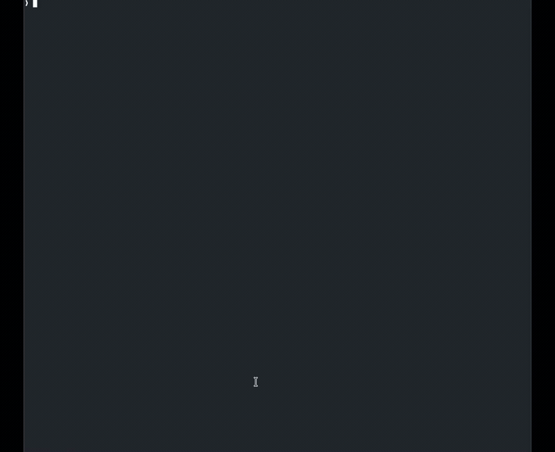

<p align="center">
  
</p>

<h1 align="center">confcli</h1>

<p align="center">A scrappy little Confluence CLI for you and your clanker</p>

<p align="center">
  
</p>

## Installation

### Binary (recommended)

Download the latest release from [GitHub Releases](https://github.com/hochej/confcli/releases).

```bash
chmod +x confcli && mv confcli ~/.local/bin/   # ensure ~/.local/bin is in PATH
```

### Cargo

```bash
cargo install confcli
```

For a **read-only build** (all write commands like create, update, delete are hidden):

```bash
cargo install confcli --no-default-features
```

<details>
<summary>Shell completions</summary>

```bash
confcli completions bash > /usr/local/etc/bash_completion.d/confcli   # Bash
confcli completions zsh  > ~/.zsh/completions/_confcli                # Zsh
confcli completions fish > ~/.config/fish/completions/confcli.fish    # Fish
```
</details>

## Quick Start

```bash
confcli auth login                     # Interactive prompts for domain/email/token
confcli auth status                    # Verify authentication
confcli space list                     # List all spaces
```

> **Tip:** Generate an API token at
> https://id.atlassian.com/manage-profile/security/api-tokens

## Commands

Every command supports `--help` for full usage details.

| Command | Description |
|---|---|
| `confcli auth login/status` | Authenticate and verify credentials |
| `confcli space list/get/pages/create/delete` | Browse and manage spaces (`--tree` for hierarchy) |
| `confcli page get/body/history/open` | Read pages — by ID or `Space:Title` |
| `confcli page create/update/delete` | Write pages (accepts `--body` or `--body-file`) |
| `confcli page edit` | Edit a page in your `$EDITOR` (`--format adf`, `--diff`) |
| `confcli search` | Full-text or CQL search (`--space` to scope) |
| `confcli attachment list/upload/download/delete` | Manage page attachments |
| `confcli label list/add/remove/pages` | Tag pages and find pages by label |
| `confcli comment list/add/delete` | Page comments |
| `confcli export` | Export page + attachments (`--format md\|storage`, `--pattern`) |
| `confcli copy-tree` | Deep-copy a page tree (`--exclude`, `--dry-run`) |

### Key features

- **Output formats** — All commands accept `-o json`, `-o table` (default), or `-o md`.
- **Dry run** — Use `--dry-run` before any destructive operation to preview what would happen.
- **`Space:Title` addressing** — Reference pages as `MFS:Overview` instead of numeric IDs.
- **Piping** — `--body-file -` reads from stdin; combine with other tools.
- **Read-only mode** — Compile with `--no-default-features` to strip all write commands. Useful for shared tooling where you want to prevent accidental modifications.

## Authentication & Security

Credentials are stored as plaintext JSON with `0600` permissions:

| OS | Path |
|---|---|
| Linux | `~/.config/confcli/config.json` (or `$XDG_CONFIG_HOME`) |
| macOS | `~/Library/Application Support/confcli/config.json` |
| Windows | `%APPDATA%\confcli\config.json` |

For CI/CD or shared environments, use environment variables instead:

```bash
export CONFLUENCE_DOMAIN=yourcompany.atlassian.net
export CONFLUENCE_EMAIL=you@example.com
export CONFLUENCE_TOKEN=<api-token>          # or CONFLUENCE_API_TOKEN
export CONFLUENCE_BEARER_TOKEN=<bearer>      # for OAuth
export CONFLUENCE_API_PATH=/wiki/rest/api    # override for Server/DC or proxied instances
```
